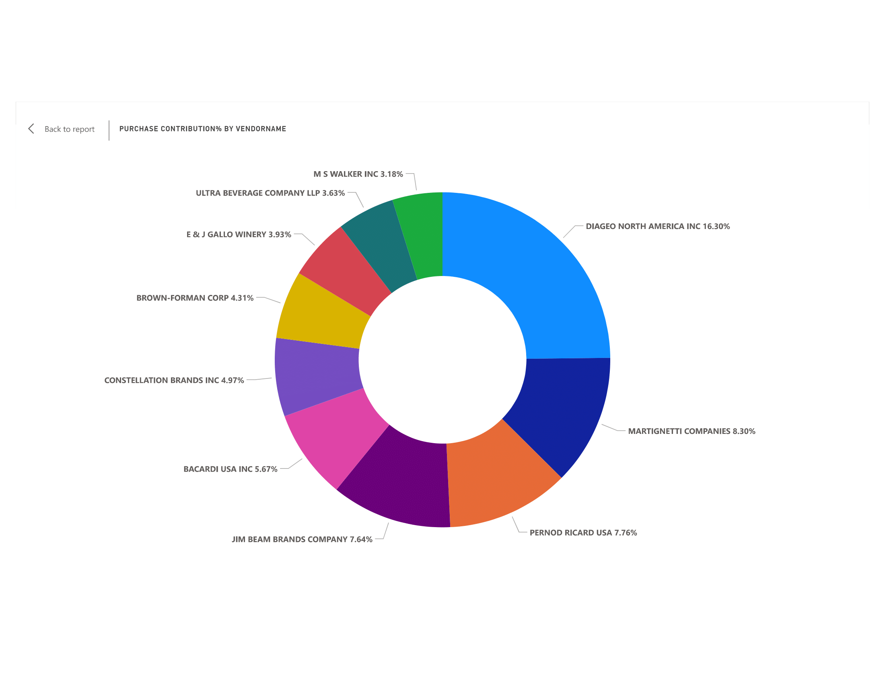
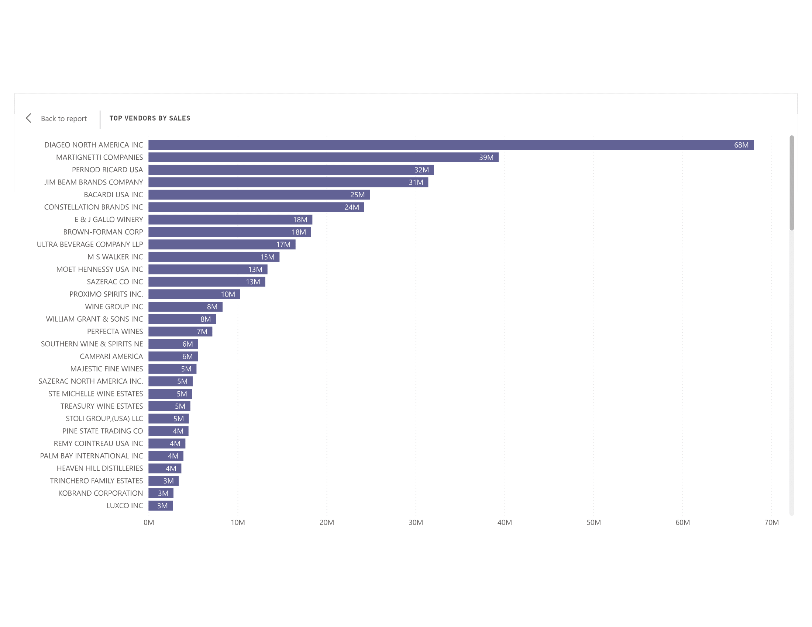
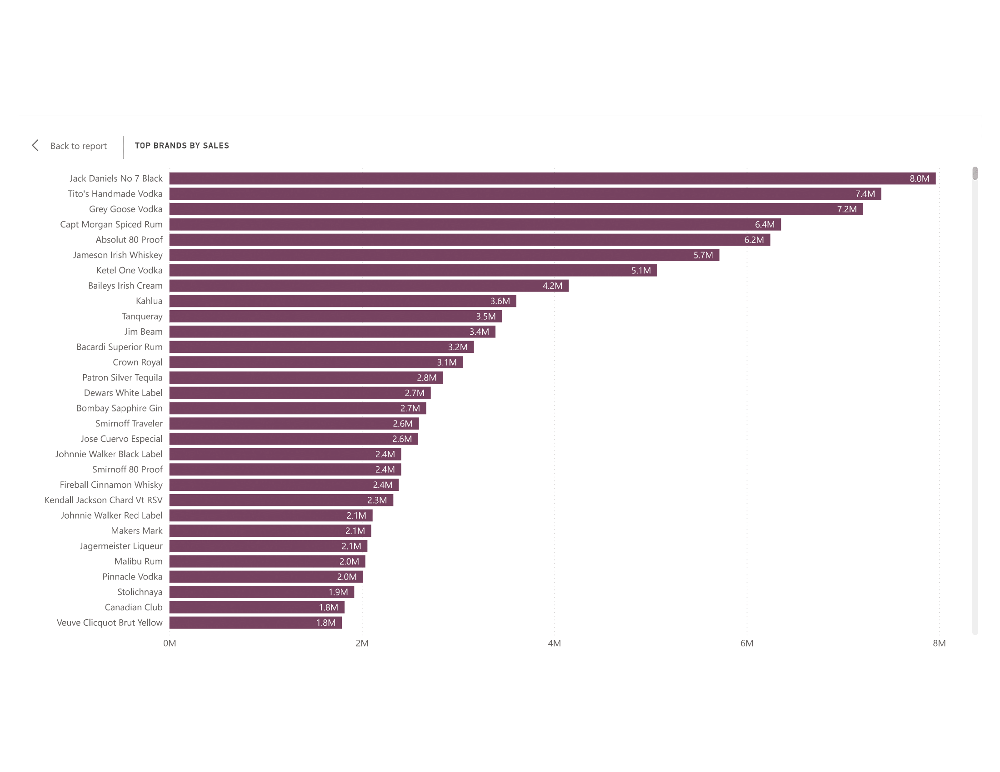
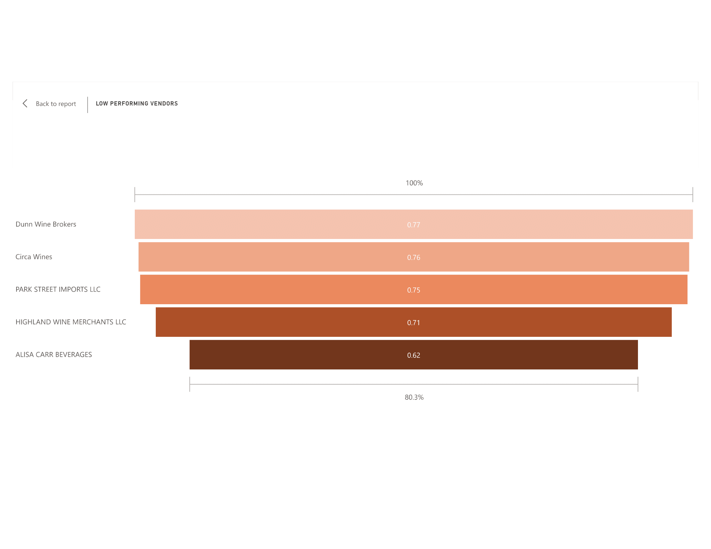
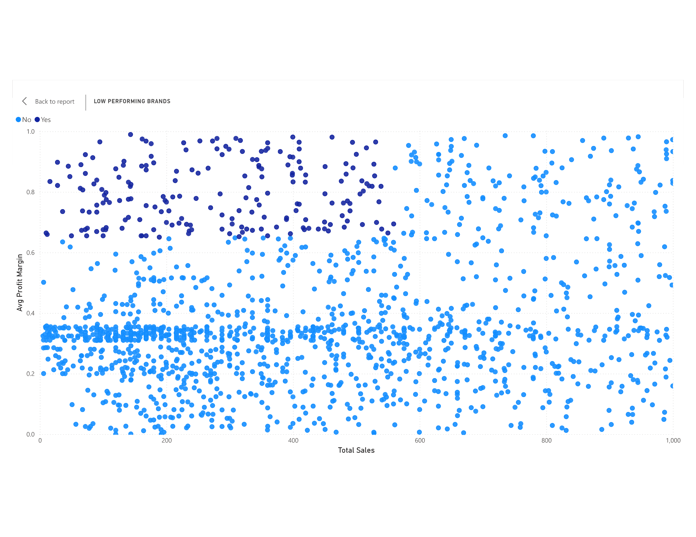

# Profitability & Risk Analytics | SQL, Python, Power BI |

## 📑 Table of Contents
- [1. Project Overview](#1-project-overview)
- [2. Business Problem](#2-business-problem)
- [3. Project Workflow](#3-project-workflow)
  - [3.1 Data Ingestion & Management](#31-data-ingestion--management)
  - [3.2 Exploratory Data Analysis (EDA)](#32-exploratory-data-analysis-eda)
  - [3.3 Data Transformation & Aggregation](#33-data-transformation--aggregation)
  - [3.4 Data Cleaning & Feature Engineering](#34-data-cleaning--feature-engineering)
  - [3.5 Advanced Analytics & Hypothesis Testing](#35-advanced-analytics--hypothesis-testing)
  - [3.6 Dashboard Creation (Power BI)](#36-dashboard-creation-power-bi)
  - [3.7 Reporting & Recommendations](#37-reporting--recommendations)
- [4. Key Findings & Business Impact](#4-key-findings--business-impact)
- [5. Achieved Results](#5-achieved-results)
- [6. Technologies Used](#6-technologies-used)
- [7. Sample Dashboard Screenshots](#7-sample-dashboard-screenshots)

---

## 1. Project Overview
This project is an **end-to-end Profitability & Risk Analytics and solution** designed for the retail/wholesale sector.  
It leverages **SQL, Python, and Power BI** to analyze purchases, sales, and inventory data, with the ultimate goal of improving **profitability, reducing risk, and optimizing vendor relationships**.

---

## 2. Business Problem
Retailers often face challenges such as:
- **Inefficient pricing** strategies leading to lost revenue.  
- **Poor inventory turnover** resulting in unsold stock and high holding costs.  
- **Vendor dependency**, increasing supply chain risks.  

This project addresses these challenges by creating an analytics framework to:  
✔ Select vendors based on performance.  
✔ Optimize product pricing & promotions.  
✔ Reduce dependency risks through diversification.  

---

## 3. Project Workflow

### 3.1 Data Ingestion & Management
- Ingested large CSV datasets (up to **2GB**) into an **SQLite database**.  
- Developed a **Python ingestion pipeline** using `pandas` + `SQLAlchemy` for automation.  
- Implemented **logging** to monitor execution and handle errors.  

### 3.2 Exploratory Data Analysis (EDA)
- Explored database tables: Purchases, Sales, Vendor Invoices, and Purchase Prices.  
- Identified key metrics such as **Sales Quantity, Purchase Quantity, Gross Profit, and Profit Margins**.  
- Mapped relationships across tables to design a consolidated data model.  

### 3.3 Data Transformation & Aggregation
- Created optimized **summary tables** (Freight, Purchases, Sales).  
- Reduced query execution time from hours to **< 1 minute** by pre-aggregating data.  
- Built a **final aggregated table with 10,692 records** for analysis.  

### 3.4 Data Cleaning & Feature Engineering
- Fixed inconsistencies (e.g., data type mismatches).  
- Engineered new features:  
  - **Profit Margin %** = Gross Profit ÷ Total Sales.  
  - **Unsold Capital** = Value of unsold inventory.  

### 3.5 Advanced Analytics & Hypothesis Testing
- Segmented vendors into **top vs. low-performing** groups.  
- Conducted **confidence interval analysis** for profit margins.  
- Ran **t-tests** to validate statistically significant differences between vendor groups.  

### 3.6 Dashboard Creation (Power BI)
Built an **interactive Power BI dashboard** with:  
- KPI cards: Total Sales, Total Purchases, Gross Profit, Unsold Capital.  
- Donut chart: Vendor contribution to purchases.  
- Bar charts: Top vendors & brands by sales.  
- Funnel chart: **Low-performing vendors** (low stock turnover).  
- Scatter plot: Target brands needing promotional/pricing adjustments.  

### 3.7 Reporting & Recommendations
- Summarized findings in a structured report.  
- Proposed actionable recommendations: pricing adjustments, vendor diversification, and inventory optimization.  

---

## 4. Key Findings & Business Impact

| **Finding** | **Impact** |
|-------------|------------|
| **198 underperforming brands** with low sales but high margins | Opportunity to boost sales volume via pricing & promotional adjustments without hurting profitability. |
| **Top 10 vendors = 65.69% of purchases** | High dependency → need for diversification to reduce supply chain risks. |
| **Bulk purchasing reduces unit price** | Identified optimal purchase volumes → improved cost savings & negotiation power. |
| **Low stock turnover for certain brands** | Risk of inventory buildup → recommended clearance sales, better storage, and purchase adjustments. |
| **Profitability variance confirmed (t-test)** | Low-performing vendors had **higher margins (40–42%)** vs. top vendors (**30–31%**) → requiring different strategies for each vendor category. |

---

## 5. Achieved Results
- ⚡ Optimized profitability by identifying pricing & promotional opportunities.  
- 📦 Improved inventory efficiency via turnover analysis and bulk purchase strategies.  
- 🤝 Strengthened vendor relationships with insights into performance & profitability.  
- 📊 Delivered a **scalable Power BI dashboard** for decision-making.  

---

## 6. Technologies Used
- **SQL (SQLite):** Data extraction, transformation, aggregation.  
- **Python (Pandas, SQLAlchemy, Matplotlib, SciPy, Seaborn):** Data ingestion, cleaning, feature engineering, statistical analysis.  
- **Power BI:** Dashboarding, interactive reporting, stakeholder communication.  

---

## 7. Sample Dashboard Screenshots  

### 🥧 Vendor Contribution (Donut Chart)  
  

### 📦 Top Vendors by Sales  
  

### 🏷 Top Brands by Sales  
  

### 📉 Low-Performing Vendors (Funnel Chart)  
  

### 🔍 Target Brands for Promotion (Scatter Plot)  
  

---
